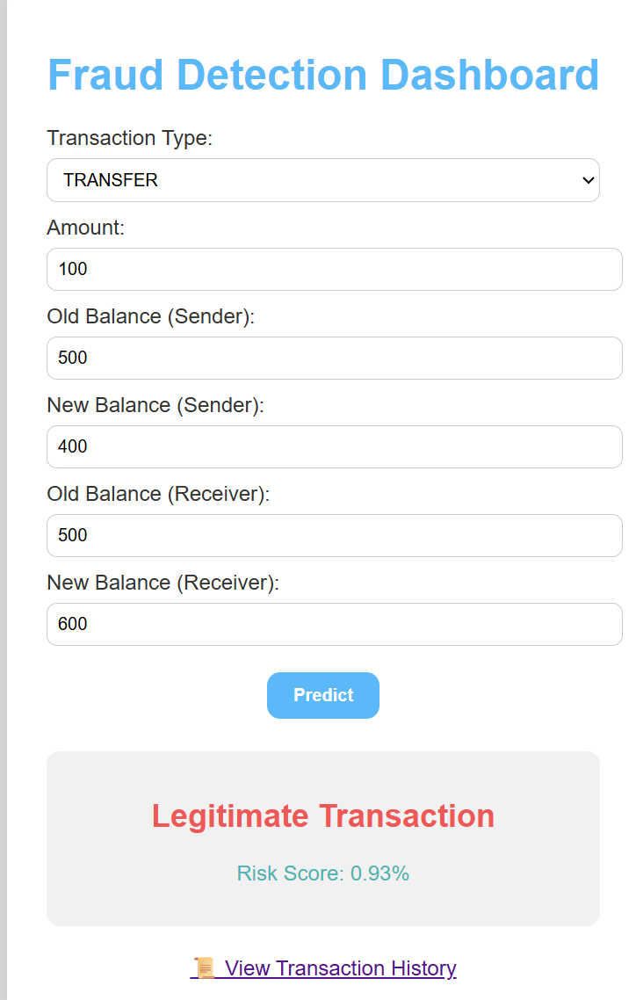

# Fraud Detection Dashboard

Fraud Detection Dashboard takes input from the user and predicts whether the transaction is Fraud,Legitimate or Suspicious based upon the rule-based logic.The model is trained using Random Forest with ~0.99 Accuracy.Users can submit their transactional data ,instantly view their risk score,track transaction data history and analyse trends through visual dashboard.

## Features
* Users can enter transaction details and instantly view the predicted fraud category along with a risk score.
* All transactions and predictions are automatically stored in an Excel file for auditing and analysis
* Users can view past transactions and their predictions directly within the dashboard.
* Combines Random Forest machine learning with rule-based logic to improve detection accuracy and handle edge cases.
* Built-in charts to analyze fraud distribution and risk patterns over time.

1.Fraud Detection Logic
* Trained dataset on Random Forest Classifier (rf_fraud_model.pkl) which outputs base fraud probability.
2. Feature Engineering
* Derived features include:

* Balance errors

* Balance differences

* Balance ratios

* Log-transformed transaction amount

3. Rule-Based Enhancements

* Risk score is increased for suspicious patterns such as:

* Very high transaction amount

* Account drained to zero

* Destination balance not updating correctly

* Amount greater than available balance

* Final risk score is capped at 100%.

  ## Risk Classification

Each transaction is classified based on the final fraud risk percentage generated by the hybrid detection system.

| Risk Percentage | Classification |
|-----------------|----------------|
| > 70%           | High Risk Fraud |
| 30% – 70%       | Suspicious Transaction |
| < 30%           | Legitimate Transaction |

This threshold-based classification helps in prioritizing high-risk transactions for immediate investigation while allowing low-risk transactions to proceed without interruption.

