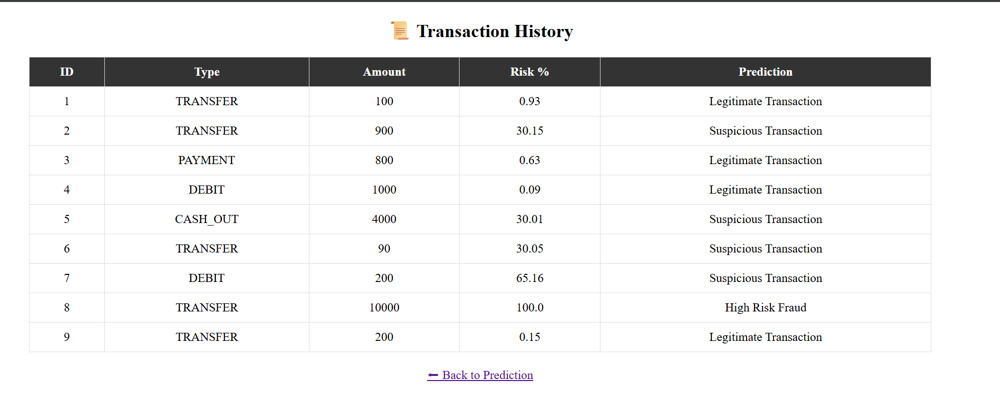
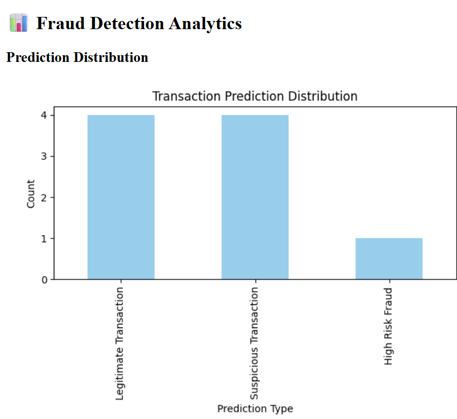
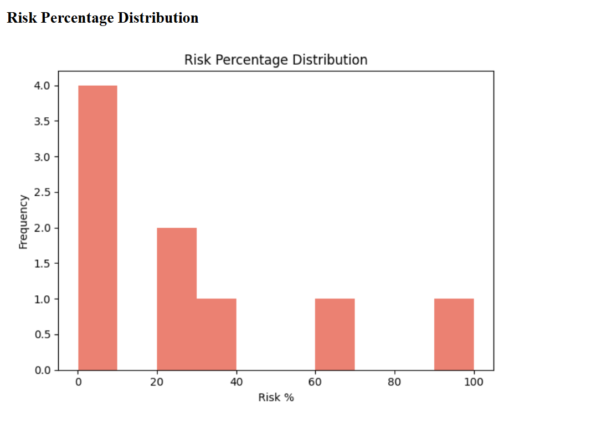

# Fraud Detection Dashboard


Fraud Detection Dashboard takes input from the user and predicts whether the transaction is Fraud,Legitimate or Suspicious based upon the rule-based logic.The model is trained using Random Forest with ~0.99 Accuracy.Users can submit their transactional data ,instantly view their risk score,track transaction data history and analyse trends through visual dashboard.

## Features
* Users can enter transaction details and instantly view the predicted fraud category along with a risk score.
* All transactions and predictions are automatically stored in an Excel file for auditing and analysis
* Users can view past transactions and their predictions directly within the dashboard.
* Combines Random Forest machine learning with rule-based logic to improve detection accuracy and handle edge cases.
* Built-in charts to analyze fraud distribution and risk patterns over time.

1.Fraud Detection Logic
* Trained dataset on Random Forest Classifier (rf_fraud_model.pkl) which outputs base fraud probability.
2. Feature Engineering
* Derived features include:

* Balance errors

* Balance differences

* Balance ratios

* Log-transformed transaction amount

3. Rule-Based Enhancements

* Risk score is increased for suspicious patterns such as:

* Very high transaction amount

* Account drained to zero

* Destination balance not updating correctly

* Amount greater than available balance

* Final risk score is capped at 100%.

  ## Risk Classification

Each transaction is classified based on the final fraud risk percentage generated by the hybrid detection system.

| Risk Percentage | Classification |
|-----------------|----------------|
| > 70%           | High Risk Fraud |
| 30% – 70%       | Suspicious Transaction |
| < 30%           | Legitimate Transaction |

This threshold-based classification helps in prioritizing high-risk transactions for immediate investigation while allowing low-risk transactions to proceed without interruption.

## 🚀 How to Run the Project

Follow the steps below to set up and run the Fraud Detection Dashboard locally.

### 1️⃣ Clone the Repository
```bash
git clone https://github.com/G-gunjan/Fraud-Detection-Dashboard.git
cd Fraud-Detection-Dashboard
```
### 2️⃣ Create a Virtual Environment 
```bash
python -m venv venv
```
Activate the virtual environment:
```bash
venv\Scripts\activate
```
### 3️⃣ Install Dependencies
```bash
pip install -r requirements.txt
```
### 4️⃣ Run the Application
```bash
python app.py
```
Once the server starts, open your browser and navigate to:
```bash
http://127.0.0.1:8000
```
## 🌐 Application Routes

| Route     | Description |
|-----------|-------------|
| `/`       | Fraud prediction dashboard |
| `/charts` | Risk & prediction analytics |
| `/history`| Transaction history table |

---

## 📈 Visualizations

- **Bar Chart:** Distribution of prediction categories
  
- **Histogram:** Risk percentage distribution
    

All charts are automatically generated and saved in the `static/` folder.

---

## 🧪 Data Storage

- All transaction predictions are stored in `history.xlsx`
- The file is automatically created when the first transaction is predicted

---

## 🛠️ Technologies Used

- Python  
- Flask  
- Scikit-learn  
- Pandas  
- NumPy  
- Matplotlib  
- OpenPyXL  
- HTML / CSS  

---

## 📄 License

This project is open-source and available under the **MIT License**.


